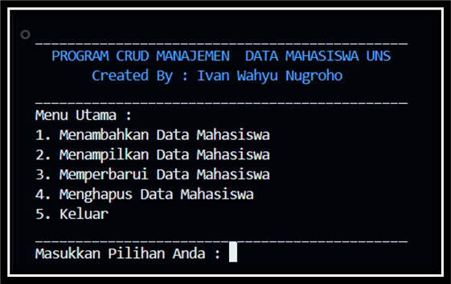
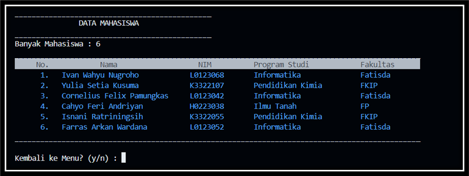
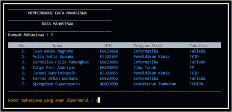
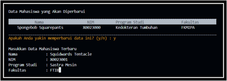
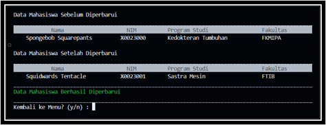
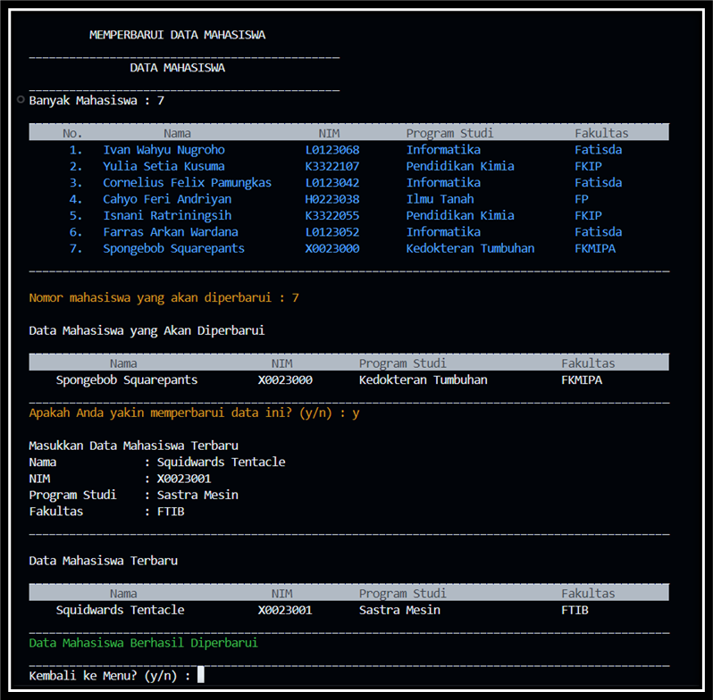
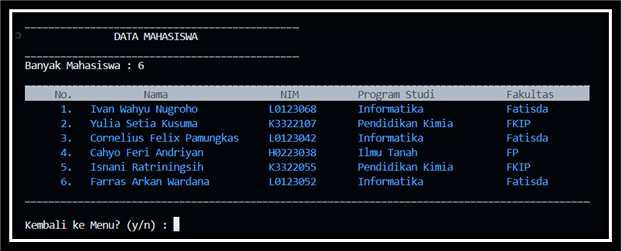
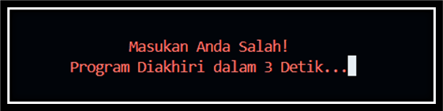
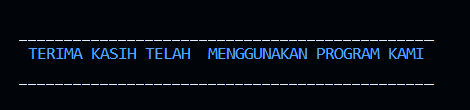

# Program CRUD Manajamen Data Mahasiswa UNS

## Latar Belakang

Program ini dibuat untuk memenuhi tugas responsi mata kuliah Struktur Data dan Algoritma (Praktikum) yang diampu oleh [Dr. Wiranto, M.Kom., M.Cs.](https://if.fatisda.uns.ac.id/team/dr-wiranto-m-kom-mcs/) dengan asisten praktikum [Mas Nasser](https://www.instagram.com/mohammednassher/) dan [Mas Handi](https://www.instagram.com/wisle25/).

## Deskripsi Program

Program ini adalah program berbasis CRUD (_create, read, update, and delete_) untuk me-_manage_ data mahasiswa UNS. Dalam program ini, pengguna dapat menambahkan data, menampilkan data, memperbarui data, dan juga menghapus data. Data mahasiswa dalam program ini meliputi nama lengkap, NIM, program studi, dan fakultas. Data mahasiswa akan disimpan dalam sebuah _database_ dengan ekstensi _file_ `.txt`. Dengan begitu, setelah selesai _running_, data yang telah ditambahkan oleh _user_ dapat kembali diakses (data tidak terhapus).

Program ini dibuat menggunakan paradigma pemrograman OOP (_object oriented programming_). Program ini mengimplementasikan berbagai macam struktur data, seperti _list_ (_vector_), _stack, queue, set, map_, dan _tree_. Dalam program ini, data mahasiswa akan ditampilkan dalam bentuk tabel. Selain itu, NIM akan divalidasi sehingga formatnya perlu mengikuti aturan NIM di UNS. Meskipun berbasis console, tampilan program ini mengalami beberapa kostumisasi sehingga visualisasinya tampak menarik.

## Instruksi Penggunaan

Program ini tidak menggunakan _library_ eksternal, semua _library_ yang dipakai merupakan build in _library_. Oleh karena itu, program ini dapat dijalankan dengan melakukan _running_ _file_ [main.cpp](./main.cpp). _User_ dapat melakukan _running_ program ini menggunakan IDE C++, code editor, seperti [Visual Studio Code](https://code.visualstudio.com/), atau menggunakan _terminal/CMD/bash_. _User_ perlu memastikan compiler C++, seperti [MinGW](https://sourceforge.net/projects/mingw-w64/) atau [Strawberry Perl](https://strawberryperl.com/) telah terpasang pada perangkat.

Menu utama program CRUD ini memberikan pilihan seperti menambahkan data, menampilkan data, memperbarui data, dan menghapus data, serta menu untuk keluar. _User_ dapat memberikan masukan barupa nomor awal menu yang ingin dipilih. Apabila _user_ memberikan masukan yang tidak dikenali, akan terdapat warning pada _console_ dengan tulisan berwarna merah selama tiga detik dan program akan diakhiri.

Jika _user_ ingin menambahkan data, _user_ dapat memberikan masukan angka `1` pada menu utama. Dalam menu menambahkan data, _user_ perlu memberikan masukan berupa nama mahasiswa, NIM, program studi, dan fakultas. NIM akan melalui validasi sehingga perlu mengikuti format NIM di UNS. Jika tidak, data tersebut tidak akan disimpan di dalam _database_. Validasi kedua adalah NIM tidak boleh terduplikasi dengan data yang sudah ada. NIM akan menjadi _primary key_ dari _database_. Jika NIM telah ditemukan di _database_, data tersebut juga tidak akan disimpan di _database_.

Jika _user_ ingin menampilkan data, _user_ dapat memberikan angka `2` pada menu utama. Kemudian, program akan menampilkan data mahasiswa yang terdapat dalam _database_. Jika _database_ kosong, _user_ perlu menambahkan data terlebih dahulu.

Jika _user_ ingin memperbarui data yang sudah ada, _user_ dapat memberikan masukan `3` pada menu utama. Program akan menampilkan data yang sudah ada dalam _database_. _User_ akan diminta memberikan nomor mahasiswa yang akan diperbarui. _User_ kemudian perlu memberikan data mahasiswa terbaru. Kemudian, _user_ akan diminta konfirmasi untuk memperbarui data. Jika _user_ memberikan masukan nomor mahasiswa melebihi jumlah mahasiswa yang ada dalam _database_, program akan mengeluarkan warning dengan tulisan berwarna merah.

Jika _user_ ingin menghapus data yang sudah ada, _user_ dapat memberikan masukan `4` pada menu utama. Program akan menampilkan data yang sudah ada dalam _database_. _User_ akan diminta memberikan nomor mahasiswa yang akan dihapus. Jika masukan sesuai, _user_ akan diminta konfirmasi untuk menghapus data. Jika _user_ memberikan masukan nomor mahasiswa melebihi jumlah mahasiswa yang ada dalam _database_, program akan mengeluarkan warning dengan tulisan berwarna merah.

Dari menu utama, jika _user_ ingin keluar dari program, _user_ perlu memberikan masukan angka `5`. Setiap selesai dari satu pilihan menu (kecuali menu keluar), _user_ akan diberikan pilihan untuk kembali ke menu atau tidak. _User_ dapat memberikan masukan `y` atau `Y` jika ingin kembali ke menu. Namun, jika _user_ ingin keluar dari program, _user_ dapat memberikan masukan `n` atau `N`.

## Fitur Program

Program CRUD ini memiliki beberapa fitur menarik, di antaranya :

* Fitur CRUD. Seperti program CRUD pada umumnya, _user_ dapat menambahkan data, menampilkan data, memperbarui data, dan juga menghapus data. Data akan disimpan rapi di dalam _database_ dan akan ditampilkan dengan format tabel di _console_ dengan rapi.

* Data mahasiswa akan tersimpan dalam _file_, bukan hanya tersimpan sementara di RAM. Hal ini memungkinkan data tersebut diakses kembali meskipun program selesai _running_.

* Jika _user_ ingin menambahkan data atau memperbarui data, NIM akan melalui validasi sehingga _user_ perlu memberikan masukan NIM sesuai format.

* Warna tulisan (_font-color_) pada _console_ dikostumisasi sehingga tampilan visualnya lebih menarik. Sebagai contoh, jika _user_ memberikan masukan yang tidak dikenali pada bagian menu utama, terdapat _notice_ tulisan berwarna merah untuk memberikan kesan _warning_ dan program akan keluar dalam waktu tiga detik.

* Fitur clear _console_ yang dinamis. Fitur ini akan membersihkan _console_ sehingga akan tampak lebih _clean_. Fitur clear _console_ ini dapat menyesuaikan ke sistem operasi yang digunakan _user_ sehingga fitur ini bekerja pada semua sistem operasi, tidak hanya Windows saja.

## Tangkapan Layar

### Tampilan Menu Utama

### Menampilkan Data Mahasiswa

### Menambahkan Data Mahasiswa

### Memperbarui Data Mahasiswa

### Menghapus Data Mahasiswa

### Menampilkan Data Kembali

### Menampilkan Pesan Kesalahan Masukan pada Menu Utama

### Akhir dari Program

## Petunjuk Awal

Pada kondisi awal program ini, _database_ secara _default_ akan diisi beberapa mahasiswa sehingga _user_ langsung dapat menampilkan data mahasiswa tanpa harus menambahkannya terlebih dahulu. Jika _user_ akan menambahkan data, NIM mahasiswa harus sesuai dengan format NIM di UNS sebab NIM akan divalidasi. Lebih detailnya, format NIM yang dimaksud mengikuti aturan berikut ini :

* NIM harus terdiri atas delapan karakter.
* Karakter pertama adalah huruf kapital dan tujuh karakter berikutnya harus berupa angka.

Pada program ini, jika _user_ memberikan masukan yang tidak dikenali pada bagian menu, program akan diakhiri dalam waktu tiga detik. Pesan kesalahan akan disampaikan dalam warna merah untuk memberikan kesan warning kepada _user_ bahwa masukan salah.

## Dikembangkan Oleh

[Ivan Wahyu Nugroho](https://instagram.com/ifwhy._) | L0123068

## Institusi

